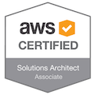
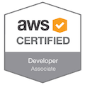
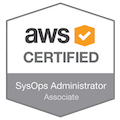

Hello Cloud & Security Enthusiasts!

With over 17 years of extensive experience in the IT industry, I bring a wealth of knowledge and expertise to the table. My focus lies in cloud technologies, particularly AWS and Azure, where I have honed my skills in architecting robust and secure solutions.

I specialize in cloud security tools such as AWS Shield, WAF, Wiz, Prisma Cloud, container security, and pipeline security, ensuring that data and applications are protected against evolving threats.

My forte lies in designing enterprise-level solutions tailored to meet the unique needs of organizations, leveraging the latest technologies and best practices. I am particularly adept at utilizing Kubernetes and Docker to orchestrate and manage containerized applications effectively.

Additionally, I am passionate about automation and have a strong command of scripting languages such as Shell and Python. This enables me to streamline processes and enhance efficiency, ultimately driving business outcomes.

With a proven track record of delivering high-quality solutions and staying abreast of industry trends, I am committed to contributing my expertise to drive innovation and success in your organization.

**Download my full CV:** [Resume](./files/anandvyas-resume-2017.pdf)

### Certifications
#### AWS 
|SOLUTIONS ARCHITECT - ASSOCIATE|DEVELOPER - ASSOCIATE|SYSOPS ADMINISTRATOR - ASSOCIATE|
|:---:|:---:|:---:|
|  |  |  |

#### Kubernetes

|CKA: Certified Kubernetes Administrator|
|:---:|
|  |